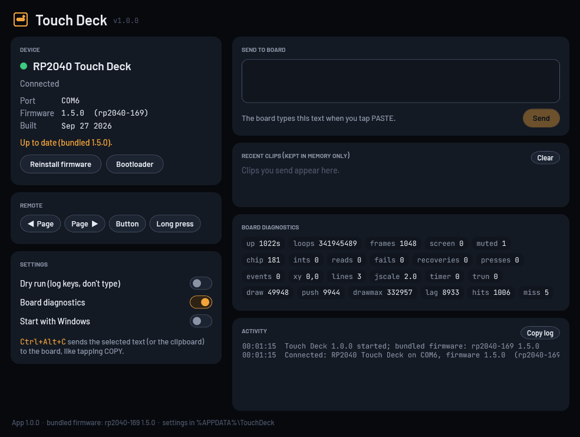

# Touch Deck

A small touch-screen board that sits on your desk and works as a **clipboard that types**, a **mouse jiggler** and, on the RP2040 board, an **analog watch**. It comes with a Windows companion app.

- **Copy:** tap COPY on the board and it grabs the text you've selected on the PC.
- **Paste:** tap PASTE and the board types that text back as real keystrokes. That works anywhere, including in places where Ctrl+V is blocked, such as remote consoles, VMs and login prompts.
- **Clip memory:** the clip lives in the board's own memory, never on the Windows clipboard.



## What's in this repo

| Folder | What | Stack |
|---|---|---|
| [`src/`](src) | Firmware for the **Waveshare RP2040-Touch-LCD-1.69** | C, Pico SDK 2.1.1, TinyUSB, dual core |
| [`esp32c3/`](esp32c3) | Firmware for the **ESP32-2424S012C** (1.28" round) | Arduino-ESP32 on PlatformIO, LovyanGFX, NimBLE |
| [`windows-app/`](windows-app) | **Touch Deck for Windows**: companion app and MSI installer | C# .NET 8 WPF, WiX v5 |
| [`tools/`](tools) | Python helper (the app's predecessor), flasher, font generator, perf script, tests | Python 3, pyserial, Pillow, pytest |
| [`docs/`](docs) | Design specs and implementation plans | Markdown |

Both boards speak the same serial line protocol, which is documented at the top of [`src/usb_io.c`](src/usb_io.c). Any PC-side tool (the Windows app, `clip_helper.py`, and a future macOS app) talks to either board the same way.

## The boards

### RP2040-Touch-LCD-1.69 (240x280, touch, buzzer)

It shows up on the PC as a USB composite device (`CAFE:4011`): a keyboard, a mouse and a serial port. Swipe between three pages:

- **Watch.** A rounded-square analog face that ticks every second on the speaker. The tick is driven by a hardware timer, so it's exactly on the second. There's a mute toggle in the corner. The **BOOT button** starts and pauses a stopwatch; a long press resets it.
- **Clipboard.** COPY asks the PC for the selected text; PASTE types it as US-layout keystrokes, adjusting for Caps Lock.
- **Jiggler.** Moves the mouse in a loose, wobbling circle. Every so often it stops, right-clicks, presses Esc, then carries on. BOOT cycles the circle size (1x, 1.5x, 2x).

Mute, jiggler on/off and circle size are saved to flash, and they survive power-off and firmware updates. The core runs at 200 MHz. Only the parts of the screen that change are redrawn, and each watch second is drawn in advance so it appears about 8 ms after the tick.

### ESP32-2424S012C (1.28" round, touch)

The ESP32-C3 has no USB keyboard/mouse hardware, so it has two **output modes**:

- **BT:** a Bluetooth LE keyboard and mouse, paired explicitly with an on-screen 6-digit passkey.
- **PC:** the board sends its key and mouse reports over USB serial, and the PC app performs them.

It has Clipboard, Jiggler and Settings pages. There's no clock or speaker on this board.

## Touch Deck for Windows

Install `TouchDeck-<version>.msi`. It installs just for you, needs no admin rights, and doesn't need .NET installed. The app:

- finds the board and shows its **firmware version**;
- handles COPY by reading the selected text (or, if nothing is selected, the clipboard);
- performs keys and mouse input in PC mode;
- updates the RP2040 firmware with one click, from firmware bundled in the app;
- sends the current selection to the board with **Ctrl+Alt+C** from any app;
- keeps a list of recent clips in memory only;
- gives you remote page and button controls, live board diagnostics, and dry-run mode;
- lives in the tray.

See [`windows-app/README.md`](windows-app/README.md) for details and build steps.

## Build

**RP2040 firmware.** The toolchain comes from the VS Code Pico extension in `~/.pico-sdk`:

```bash
P=~/.pico-sdk; export PATH="$P/ninja/v1.12.1:$P/cmake/v3.31.5/bin:$PATH"
cmake -S . -B build -G Ninja -DCMAKE_BUILD_TYPE=Release   # once
ninja -C build                                            # -> build/watch.uf2
python tools/flash.py                                     # BOOT over serial, copy to the UF2 drive
```

You can also flash from the Windows app with **Install firmware**.

**ESP32-C3 firmware:**

```bash
cd esp32c3
python -m platformio run                                  # build
python -m platformio run -t upload --upload-port COM7     # flash (no BOOT button needed)
```

**Windows app:**

```powershell
cd windows-app
.\build.ps1          # bundle firmware from ../build, test, publish, MSI -> out\TouchDeck-<ver>.msi
```

**Python helper (optional, instead of the app):**

```bash
pip install -r tools/requirements.txt
python tools/clip_helper.py            # --send TEXT, --boot, --debug, --dry-run
```

Only one program can hold the board's serial port at a time. Quit the app before using `clip_helper.py`, `flash.py` or the board tests, and the other way round.

## Tests

- `pytest tools/tests` covers the helper protocol, the SendInput injector, and the font generator, including a check that every UI label fits its button. The `test_board_*` files drive a connected board and skip when it's absent.
- `dotnet test windows-app/TouchDeck.sln` covers the app: protocol, injection, session, device manager, settings and firmware update, plus hardware smoke tests.
- `windows-app/tools/install-smoke.ps1` is a real install, run and uninstall check of the MSI.

## Firmware versions

`src/version.h` and `esp32c3/src/version.h` define the board ID and version, and the `VER` command reports them. Bump `FW_VERSION` whenever the firmware changes. The Windows app compares the board's version with the one it bundles and offers the update.

## Credits

- Fonts: [Barlow](https://github.com/jpt/barlow) and [JetBrains Mono](https://github.com/JetBrains/JetBrainsMono) under the SIL Open Font License, and [DSEG7](https://github.com/keshikan/DSEG) for the stopwatch. Their license texts are in [`tools/fonts/`](tools/fonts).
- Hardware: Waveshare RP2040-Touch-LCD-1.69 and ESP32-2424S012C.
- This project has no license file yet.
