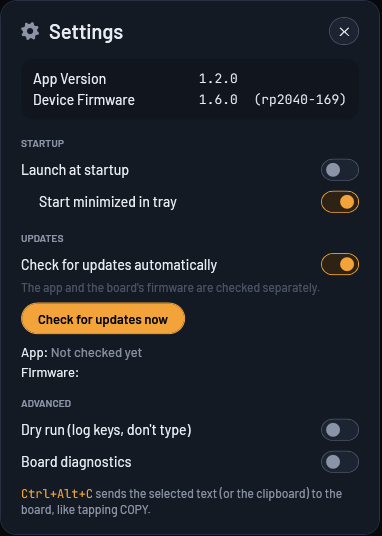

# Touch Deck for Windows

The Windows companion app for the Touch Deck boards (it replaced the old Python helper).




## What it does

- **Finds the board.** It scans USB serial ports for `CAFE:4011` (RP2040-Touch-LCD-1.69) and `303A:1001` (ESP32-2424S012C), checks each with `HELLO`→`PONG`, and reconnects after an unplug.
- **Shows the firmware version.** It sends `VER` and displays the board ID, version and build date. Firmware older than 1.5.0 has no `VER` and shows as "unknown".
- **COPY.** When you tap COPY on the board, the app sends the focused control's selected text (UI Automation) or, failing that, the clipboard. Text is transliterated to ASCII, as the board types US-layout keys.
- **PC output mode (ESP32-C3).** It performs the board's `K`/`M` keyboard and mouse reports with `SendInput` scancodes and reports Caps Lock back as `LEDS`. If the link drops, it releases any held key or button.
- **Send to board.** Type or paste text in the app, or press **Ctrl+Alt+C** anywhere to send the current selection.
- **Recent clips.** It keeps the last 10 clips in memory only (never on disk), with Resend and Copy buttons.
- **Jiggler card (firmware 1.6.0+).** A live copy of the board's jiggler:
  - the active letter's lane with the moving dot;
  - ON/OFF and size (1.0X/1.5X/2.0X) buttons, and a click on the letter to toggle;
  - the board's status (Moving, Right-click menu, …).

  The Send card shows "Board clip: N chars" with a **Clear** button (the board's trash can). Older firmware gets a note to update instead.
- **Remote.** Page ◀ ▶ and the BOOT button (stopwatch start/pause and reset, jiggler size).
- **Board diagnostics.** Optionally polls the live `DBG` counters every 2 s.
- **Firmware update (RP2040).** The app bundles the RP2040 firmware. It reboots the board into its UF2 drive, checks that the image really is an RP2040 UF2, copies it, and waits for the board to report its new version. It also notices a board already sitting in its bootloader. ESP32-C3 firmware is still flashed with PlatformIO.
- **Tray.** The tray icon's colour shows the link state. Closing the window keeps the app running in the tray. Only one instance runs at a time, and a second launch brings the first to the front.
- **Settings** (cog in the header):
  - **Versions:** App Version, and Device Firmware (dimmed when no board is attached).
  - **Startup:** Launch at startup, and Start minimized in tray under it.
  - **Updates:**
    - Check for updates automatically, at start and daily.
    - **Check for updates now**, with separate App and Firmware results and an **Install** button for each.
    - An app update downloads, is verified, installs itself and restarts the app. A firmware update downloads, is verified and is flashed.
  - **Advanced:** Dry run, Board diagnostics.
- **Error log.** Unexpected errors go to `%APPDATA%\TouchDeck\errors.log`, useful in a bug report.
- **Settings.** Dry run (log the keys and mouse input instead of performing them), diagnostics, and Start with Windows. They're stored in `%APPDATA%\TouchDeck\settings.json`.

## Install

Run `TouchDeck-<version>.msi`. It installs for the current user, needs no admin rights, and goes to `%LOCALAPPDATA%\Programs\Touch Deck` with a Start-menu shortcut.

- **Upgrading:** install the newer MSI over the old one. It closes a running copy first.
- **Downgrading:** installing an older MSI over a newer one is refused.
- **Uninstalling:** use Apps & Features. It also removes the Start with Windows entry.

Only one program can hold the board's serial port. The app shows "COMx is in use" when another program has it.

## Build

You need the .NET 8 SDK. WiX v5 comes through NuGet, so there's nothing to install.

```powershell
.\build.ps1                 # refresh firmware from ..\build, test, publish, MSI -> out\TouchDeck-<ver>.msi
.\build.ps1 -SkipTests -Smoke
.\build.ps1 -Version 1.0.1  # override the version (default: Directory.Build.props)
.\tools\install-smoke.ps1   # install the MSI, verify, run the installed app, uninstall
.\tools\update-e2e.ps1     # real in-app update 1.1.98 -> 1.1.99 from a loopback feed
```

- Tests: `dotnet test`. Hardware tests skip when no board is plugged in, or when its port is busy.
- `TouchDeck.exe --smoke DIR` waits for a board, writes `DIR\smoke.png` (the window) and `DIR\smoke.txt` (what it detected), then quits.
- Icons: `python tools/make_icons.py` (Pillow).

## Layout

| Path | What |
|---|---|
| `src/TouchDeck.Core` | Everything without UI: protocol, device scan and serial transport, session loop, input injection, selection, settings, firmware update |
| `src/TouchDeck.App` | WPF window, tray icon, hotkey, the controller that marshals Core events to the UI |
| `tests/TouchDeck.Tests` | xUnit tests: unit tests with fakes, plus hardware smoke tests |
| `installer/` | WiX v5 per-user MSI |
| `firmware/` | The bundled RP2040 UF2 and `manifest.json` (board, version, file), refreshed by `build.ps1` |
